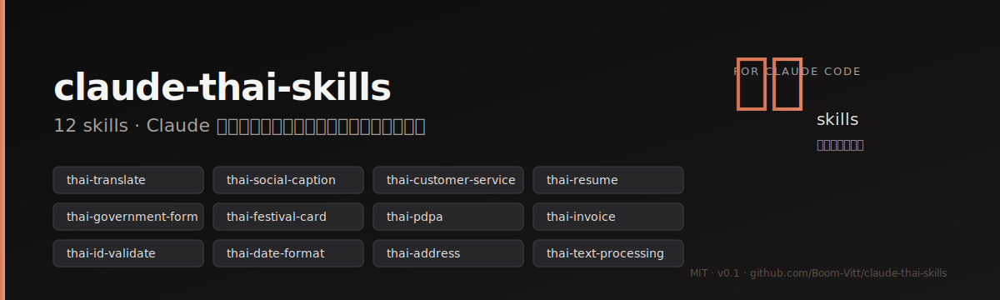

<div align="center">



<br/>

[](LICENSE)
[](https://docs.claude.com/en/docs/claude-code)
[](#skills--ตัวที่มี)
[](https://github.com/Boom-Vitt/claude-thai-skills/actions/workflows/test.yml)

</div>

> Claude เก่งภาษาไทยอยู่แล้ว — แต่พอเจอ "ออกใบกำกับภาษี ภ.ง.ด.3 VAT 7%" หรือ "ขึ้นต้นจดหมายถึงปลัด" มันก็เดามั่วเหมือนเด็กแลกเปลี่ยนปีหนึ่ง.
>
> รีโปนี้คือ 12 skills ที่ผมเขียนไว้ใช้เอง — ติดตั้งครั้งเดียว Claude หยิบใช้เองอัตโนมัติเวลาเจอ task ภาษาไทย.

---

## ติดตั้ง / Install

```bash
# วิธีที่แนะนำ — ผ่าน Claude Code plugin marketplace
/plugin marketplace add Boom-Vitt/claude-thai-skills
/plugin install claude-thai-skills
```

<details>
<summary><b>วิธีอื่น</b> — clone + script, หรือ copy เฉพาะตัว</summary>

```bash
# Clone แล้วรันสคริปต์ติดตั้งทุกตัว
git clone https://github.com/Boom-Vitt/claude-thai-skills.git
cd claude-thai-skills
./install.sh                  # ทุก skill
./install.sh thai-resume      # เฉพาะที่ต้องการ

# หรือ copy เฉพาะตัวที่ต้องใช้
cp -r skills/thai-invoice ~/.claude/skills/
```

</details>

หลังติดตั้ง: เปิด session ใหม่ ลองพิมพ์อะไรเป็นภาษาไทยตามด้านล่าง Claude จะหยิบ skill ที่เหมาะสมเอง.

---

## เรื่องมีอยู่ว่า / Why this exists

คืนหนึ่งผมขอ Claude ออกใบกำกับภาษีให้ลูกค้า. มันก็ออกให้ — แต่ลืมแยก VAT 7%, สะกดชื่อบริษัทผิด, แล้วใส่วันที่เป็น `May 16, 2025` ทั้งที่เอกสารราชการไทยต้องเป็น `๑๖ พฤษภาคม ๒๕๖๘`. ผมแก้เอง 10 นาที. รอบหน้าก็ผิดอีก. รอบหน้าก็ผิดอีก.

ผมเลยเริ่มจดรายการสิ่งที่ Claude พลาดซ้ำๆ ในบริบทไทย:

1. ฟอร์แมตวันที่สลับ พ.ศ./ค.ศ. — Claude ขึ้น `2025` ตอนที่ documents ต้องเป็น `2568`
2. ขึ้นต้นจดหมายราชการด้วย `เรียน` แทน `กราบเรียน` ในเคสที่ต้องใช้ตามระเบียบสำนักนายกฯ
3. ออกใบกำกับภาษีโดยไม่แยก VAT line ตามมาตรา ๘๖/๔
4. เช็คเลขบัตรประชาชนด้วย regex 13 หลักเฉยๆ ไม่ได้เช็ค checksum
5. แปล `you` เป็น `คุณ` หมดทุกที่ — ทั้งที่ควรจะเป็น `พี่/น้อง/ท่าน` ตาม context
6. เขียน privacy notice เป็น template GDPR ทั้งที่ PDPA ไทยห้าม pre-check checkbox
7. แคปชั่น TikTok ภาษาไทยที่ออกมาเหมือน Google Translate ของยุค 2014
8. ตอบลูกค้า LINE OA ด้วย register ผิด — `ขอโทษอย่างสูง` ตอนเรื่องเล็กๆ
9. เรซูเม่ที่ใส่ DOB กับศาสนาตามฟอร์แมต US ทั้งที่ไทยส่วนใหญ่ยังคาดหวัง
10. ตัดคำภาษาไทยด้วย `.split(" ")` (ภาษาไทยไม่มีเว้นวรรค — มันได้ token เดียวยาวๆ)
11. แยกที่อยู่ไทยโดย parse แบบ English address (ตำบล/อำเภอ/จังหวัด สลับลำดับ)
12. PromptPay QR ที่สร้างขึ้นมาแล้ว app ธนาคารไม่ยอมสแกน (CRC ผิด, payload ไม่ถูก EMVCo TLV)

รายการมัน 12 ข้อพอดี — ผมเลยเขียน 12 skills. ใช้ทุกวัน maintain ทุกวัน. รีโปนี้คือผลลัพธ์.

---

## Skills — ตัวที่มี

> [!TIP]
> ตัวที่ผมใช้บ่อยสุดคือ `thai-date-format` กับ `thai-invoice` — ลองเริ่มจากสองตัวนี้ก่อน

### ✍️ การเขียน & การสื่อสาร

- **[thai-translate](skills/thai-translate)** — แปล EN ⇄ TH โดยรักษา register, สรรพนาม, idiom. ไม่ได้แค่ translate — มันรู้ว่า `you` ต้องเป็น `พี่/น้อง/ท่าน` ตาม context
- **[thai-social-caption](skills/thai-social-caption)** — แคปชั่น Facebook, TikTok, IG, Threads, X, Pantip ที่ไม่เหมือน Google Translate
- **[thai-customer-service](skills/thai-customer-service)** — reply ลูกค้า LINE OA / Shopee / Lazada / IG DM / TikTok Shop พร้อม apology ladder (`ขออภัย` → `ขอโทษอย่างสูง` → `ขอแสดงความเสียใจอย่างยิ่ง`)

### 🏛 เอกสารทางการ

- **[thai-resume](skills/thai-resume)** — เรซูเม่ภาษาไทย / bilingual TH-EN สำหรับ JobsDB, JobThai, LinkedIn TH (รู้ว่าตอนไหนใส่ DOB ตอนไหนไม่ใส่)
- **[thai-government-form](skills/thai-government-form)** — หนังสือราชการ, คำร้อง, ใบลา, หนังสือมอบอำนาจ ตามระเบียบสำนักนายกฯ ว่าด้วยงานสารบรรณ
- **[thai-festival-card](skills/thai-festival-card)** — อวยพรปีใหม่, สงกรานต์, ลอยกระทง, คำไว้อาลัย, การ์ดแต่งงาน (รวม taboo เลข ๔ / สี / ของห้ามให้)

### 🧾 บัญชี & กฎหมาย

- ⭐ **[thai-invoice](skills/thai-invoice)** — ใบกำกับภาษี, ใบเสร็จ, ใบเสนอราคา, ภ.ง.ด.3/53 ตาม Revenue Code §86/4 (มี `calc.py` คำนวณ VAT / WHT ด้วย `Decimal` ไม่หลุดสตางค์)
- **[thai-pdpa](skills/thai-pdpa)** — privacy notice + consent banner ที่ compliance ของจริง ไม่ใช่ GDPR translate มา

### 🔢 ข้อมูล & ฟอร์แมต

- ⭐ **[thai-date-format](skills/thai-date-format)** — แปลง พ.ศ. ↔ ค.ศ., ฟอร์แมตวันที่ราชการ/business/casual, เลขไทย ๐๑๒๓ (Python + TypeScript)
- **[thai-id-validate](skills/thai-id-validate)** — เช็คเลขบัตร ปชช. 13 หลักด้วย checksum จริง, normalize เบอร์โทร, สร้าง PromptPay QR payload ที่ scan ผ่าน
- **[thai-address](skills/thai-address)** — แยกที่อยู่ไทย, รหัสไปรษณีย์ → จังหวัด (77 จังหวัด lookup table)
- **[thai-text-processing](skills/thai-text-processing)** — ตัดคำภาษาไทยด้วย PyThaiNLP, NFC normalize, Thai collation, romanize RTGS

`⭐` = ตัวที่ผมใช้บ่อยที่สุด.

---

## ลองดู / Try it

หลังติดตั้งเสร็จ เปิด Claude Code แล้วพิมพ์อะไรพวกนี้ดู:

```
ออกใบกำกับภาษี ค่าบริการ design 30,000 บาท ลูกค้า บริษัท X จำกัด

แปลงปี 2568 เป็น ค.ศ. และเขียนวันที่ 16 พ.ค. แบบราชการให้ที

เขียนหนังสือลาป่วยถึงผู้อำนวยการ 3 วัน เพราะไข้หวัดใหญ่

ตรวจเลขบัตรประชาชน 9999999999994 ว่า checksum ผ่านไหม (เลขทดสอบ ไม่ใช่ของจริง)

เขียนแคปชั่น TikTok โปรโมตคาเฟ่ใหม่ที่ทองหล่อ ราคา 120 บาท

reply ลูกค้า LINE OA ที่บ่นว่าของเสีย ขอเงินคืน

เขียน privacy policy สำหรับเว็บขายของ ต้อง compliance PDPA

ตัดคำประโยค "ฉันรักการเขียนโค้ดภาษาไทยมาก" ด้วย PyThaiNLP
```

Claude หาเอง — คุณพิมพ์ภาษาไทยปกติ มันจะรู้ว่าจะหยิบ skill ไหน. ถ้ามันหยิบผิด เปิด issue บอกได้.

---

## โครงสร้างไฟล์

```
claude-thai-skills/
├── .claude-plugin/
│   ├── plugin.json          # Plugin metadata
│   └── marketplace.json     # Marketplace listing
├── .github/
│   ├── workflows/test.yml   # CI: รัน scripts/test-all.sh ทุก push/PR
│   ├── ISSUE_TEMPLATE/      # bug / content correction / feature templates
│   └── PULL_REQUEST_TEMPLATE.md
├── assets/banner.svg
├── scripts/
│   ├── test-all.sh          # รัน self-test ทุก skill ในคำสั่งเดียว
│   └── validate-skills.py   # ตรวจ frontmatter ของ SKILL.md ทุกตัว
├── skills/
│   ├── thai-invoice/
│   │   ├── SKILL.md
│   │   ├── calc.py          # ← VAT/WHT calc, Decimal-based
│   │   └── templates/       # ใบกำกับภาษี / quotation / WHT cert
│   ├── thai-id-validate/
│   │   ├── SKILL.md
│   │   ├── validate.py      # checksum + PromptPay QR
│   │   └── validate.ts
│   └── ... (12 skills total)
├── template/
│   └── SKILL.md             # scaffold สำหรับสร้าง skill ใหม่
├── docs/
│   ├── my-setup-th.md       # ทัวร์ config ส่วนตัว (sanitized)
│   └── recommended-mcp.md   # MCP servers แนะนำ
├── install.sh
├── AGENTS.md                # คู่มือสำหรับ AI agent (Claude, Codex, Cursor, ฯลฯ)
├── CONTRIBUTING.md          # ขั้นตอนการ contribute, ตั้งค่าเครื่อง, รัน test
├── SECURITY.md              # รายงานช่องโหว่ + disclaimer เนื้อหากฎหมาย
├── CHANGELOG.md             # บันทึก release ตาม Keep a Changelog
├── THIRD_PARTY_NOTICES.md   # เครดิตไลบรารีและแหล่งอ้างอิงทางการ
├── LICENSE                  # MIT
└── README.md
```

---

## คุณภาพ / Quality

| Tier | Skills | สถานะ |
|---|---|---|
| **Validator (มี code + tests)** | `thai-id-validate`, `thai-date-format`, `thai-address`, `thai-invoice` | Python + TypeScript self-test ผ่านครบ |
| **Prose / Reference** | อีก 8 ตัว | v0.1 — ครบเนื้อหา ยังไม่ผ่าน adversarial testing |

รัน self-test ทุกตัวพร้อม validator ที่ตรวจ `SKILL.md` ของทั้ง 12 skill ในคำสั่งเดียว:

```bash
./scripts/test-all.sh
```

ทุก commit ที่ push ไปยัง `main` และทุก pull request จะรันคำสั่งเดียวกันนี้ผ่าน GitHub Actions โดยอัตโนมัติ — ดู workflow ที่ [.github/workflows/test.yml](.github/workflows/test.yml). รายละเอียดวิธี register self-test ของ skill ใหม่ใน CI อยู่ใน [CONTRIBUTING.md](CONTRIBUTING.md).

> [!NOTE]
> ตัวอย่างทุกอย่างในรีโปนี้ (เลขบัตรประชาชน, เบอร์โทร, ที่อยู่, ชื่อบริษัท) เป็น **synthetic test fixtures** — สร้างให้ผ่าน checksum, ไม่ใช่ของบุคคล/องค์กรจริง

---

## ข้อจำกัดที่รู้ตัวดี / Known limitations

ผมเขียนรีโปนี้คนเดียว ตอนกลางคืน หลังเลิกงานลูกค้า. ใช้เองทุกวันก็จริง แต่ก็มีจุดอ่อน:

- `thai-address/parse.py` แยกชื่อถนนแบบ single-token — ถนนหลายคำ (เช่น `พระราม 9`) อาจตัดผิด
- `thai-pdpa` อ้างอิงประกาศ PDPC ฉบับที่ผมเช็คล่าสุด — กฎหมายเปลี่ยนได้, ถ้ามีประกาศใหม่กระทบ เปิด issue
- `thai-invoice` ใช้ VAT 7% / WHT rates ปัจจุบัน — ถ้ารัฐบาลปรับ rate (เช่น VAT กลับเป็น 10%) ต้องอัปเดต
- 8 prose skills ยังไม่ผ่าน adversarial test scenarios ตาม `superpowers:writing-skills` flow
- ตัวที่ผมยังไม่ค่อยกล้าใช้คือ `thai-pdpa` — กฎหมายเปลี่ยนเร็ว, ใครเป็น lawyer ช่วย review หน่อย 🙏

ถ้า Revenue Code เปลี่ยน, PDPC ออกประกาศใหม่, หรือ DOPA เปลี่ยน format เลขบัตร — ผมอาจรู้ช้ากว่าทุกคน. เปิด issue ถ้าเจออะไรล้าสมัย, อย่ารอผมไปเจอเอง.

---

## ร่วมพัฒนา / Contributing

ภาษาที่ใช้: เขียน issue หรือ PR ได้ทั้งภาษาไทยและอังกฤษ.

- **เพิ่ม skill ใหม่:** อ่าน skill เก่าเป็น reference ก่อน. ตั้งชื่อ `thai-<topic>`. Frontmatter ใส่ trigger ภาษาไทยในเครื่องหมายคำพูด — ที่ Claude ใช้ match.
- **เจอเนื้อหาผิด (โดยเฉพาะ legal / Revenue / PDPA):** เปิด issue พร้อมแหล่งอ้างอิง.
- **มี test scenario:** PR ได้เลย — `thai-pdpa`, `thai-resume`, `thai-government-form` ต้องการที่สุด.

ขั้นตอนละเอียด, วิธีรัน test runner, รูปแบบ commit, และข้อแนะนำสำหรับเนื้อหาที่อ้างอิงกฎหมายอ่านได้ใน [CONTRIBUTING.md](CONTRIBUTING.md). ถ้าจะเพิ่ม skill ใหม่ใช้ [template/SKILL.md](template/SKILL.md) เป็น scaffold. AI agent (Claude, Codex CLI, Cursor, Gemini CLI, ฯลฯ) อ่าน [AGENTS.md](AGENTS.md) เป็นจุดเริ่ม. ประวัติ release อยู่ใน [CHANGELOG.md](CHANGELOG.md). ที่มาของไลบรารีและสเปกของหน่วยงานราชการที่ skill อ้างอิงระบุไว้ใน [THIRD_PARTY_NOTICES.md](THIRD_PARTY_NOTICES.md). ถ้าพบช่องโหว่ด้านความปลอดภัย โปรดรายงานตามขั้นตอนใน [SECURITY.md](SECURITY.md) แทนการเปิด public issue.

ไม่ต้องเกรงใจ. ผมเองก็เขียนใต้กดดันบางครั้ง — เจอบั๊กบอกได้ตรงๆ.

---

## เพิ่มเติม

- **[docs/my-setup-th.md](docs/my-setup-th.md)** — ทัวร์ config Claude Code ส่วนตัวของผม (settings, hooks, plugins, subagents — ลบข้อมูลลับแล้ว)
- **[docs/recommended-mcp.md](docs/recommended-mcp.md)** — MCP servers ที่ผมแนะนำสำหรับงานในไทย
- **[docs/AUDIT-2026-05.md](docs/AUDIT-2026-05.md)** — ผลตรวจ skill ทั้ง 12 ตัวจากมุม Thai use-case (พฤษภาคม 2569) พร้อม finding ID ที่ PR ถัดไปอ้างได้

---

## License

[MIT](LICENSE).

## ขอบคุณ

- แรงบันดาลใจจาก [mattpocock/skills](https://github.com/mattpocock/skills), [obra/superpowers](https://github.com/obra/superpowers), [anthropics/skills](https://github.com/anthropics/skills)
- อ้างอิง [PyThaiNLP](https://github.com/PyThaiNLP/pythainlp), [dtinth/promptpay-qr](https://github.com/dtinth/promptpay-qr), [กรมสรรพากร](https://www.rd.go.th/), [PDPC](https://www.pdpc.or.th/)

<br/>

<div align="center">

ทำด้วย ☕ จากกรุงเทพ — กาแฟยังไม่ทันชงเสร็จก็ deploy แล้ว
<br/>
by [@Boom-Vitt](https://github.com/Boom-Vitt)

</div>
